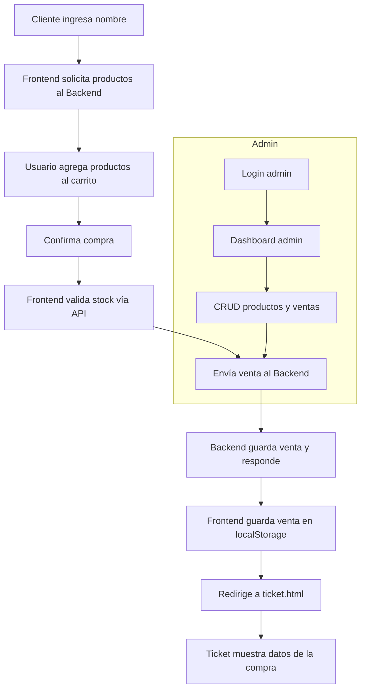

# Gaming - TP Integrador Programación III

## Integrantes y Contacto

- **Santino Casado**  
  GitHub: [SantinoCasado](https://github.com/SantinoCasado)  
  Email: santino.casado@email.com
- **Thiago Patricio Fernandez Lado**  
  GitHub: [thiagopatricio](https://github.com/thiagopatricio)  
  Email: thiago.fernandez@email.com

¿Dudas, sugerencias o contacto? Puedes escribirnos por email o GitHub.

## Descripción

Sistema de autoservicio para la compra de productos de tecnología (hardware y software), con panel de administración para gestión de productos y ventas. Incluye frontend responsive y backend con API REST y vistas EJS.

## Estructura del Proyecto

- **frontend/**: HTML, CSS, JS, assets y lógica de cliente
- **backend/**: Node.js, Express, Sequelize, vistas EJS, API y lógica de servidor

## Tecnologías

- Node.js, Express, Sequelize, MySQL
- EJS, Bootstrap, CSS personalizado
- JavaScript (ES6), LocalStorage

## Instalación y ejecución

1. Clonar el repositorio
2. Instalar dependencias en `backend/` (`npm install`)
3. Configurar la base de datos (ver `backend/DATABASE_SETUP.txt`)
4. Iniciar el backend (`npm start` en `backend/`)
5. Abrir `frontend/index.html` en el navegador

## Funcionalidades principales

- Compra de productos por autoservicio
- Ticket de compra descargable en PDF
- Panel admin: alta, baja, modificación y activación de productos
- Paginación, cambio de tema, validaciones y navegación por botones
- API REST para productos y ventas

## Diagrama de flujo de datos

## Endpoints principales (API)

- `GET /api/products` - Listar productos activos (paginados)
- `GET /api/products/:id` - Detalle de producto
- `POST /api/sales` - Registrar venta
- `GET /api/sales` - Listar ventas con productos asociados
- `POST /api/users/admin` - Crear usuario administrador

## Imágenes del proyecto

Agrega aquí capturas de pantalla del sistema funcionando:

## Notas

- El sistema es responsive y funciona en desktop y móvil
- El ticket se genera automáticamente tras la compra
- El panel admin requiere login y permite gestión completa de productos

---

¡Gracias por revisar nuestro trabajo!
