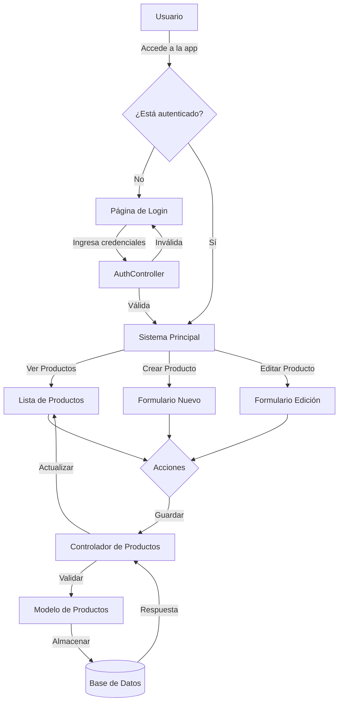

# Aplicación de Gestión de Productos (MVC)

Este proyecto es una aplicación web desarrollada con Node.js y Express que implementa el patrón MVC (Modelo-Vista-Controlador) para gestionar un catálogo de productos con sistema de autenticación de usuarios.

## 🔄 Flujo de la Aplicación

### Diagrama de Flujo Principal



### 📝 Detalle del Flujo

1. **Inicio y Autenticación**:
   ```
   Usuario → Login → Validación → Sistema Principal
   ```
   - El usuario accede a la aplicación
   - Si no está autenticado, se redirige al login
   - `authController.js` valida las credenciales
   - Al autenticarse, accede al sistema

2. **Gestión de Productos**:
   ```
   Sistema Principal → Listado/Formularios → Controlador → Modelo → Base de Datos
   ```
   - Usuario puede ver, crear o editar productos
   - Las acciones pasan por el controlador
   - El modelo gestiona la persistencia
   - La vista se actualiza con los cambios

3. **Flujo de Datos**:
   ```
   Request → Middleware → Router → Controller → Model → Database
   Response ← View ← Controller ← Model
   ```

## �📋 Requisitos Previos

Antes de comenzar, asegúrate de tener instalado:

- [Node.js](https://nodejs.org/) (versión 12 o superior)
- [npm](https://www.npmjs.com/) (viene incluido con Node.js)
- [MySQL](https://www.mysql.com/) (base de datos)

## 🚀 Instalación

1. **Ingresar a**:
   ```powershell
   cd productos_mvc
   ```

2. **Configurar Base de Datos**:
   - Crear base de datos MySQL llamada `productos_usuarios_node`
   - Configurar credenciales en `models/db.js`

3. **Instalar Dependencias**:
   ```powershell
   npm install
   ```

4. **Iniciar la Aplicación**:
   ```powershell
   npm start
   ```

5. **Acceder**:
   ```
   http://localhost:3000
   ```

## 🏗️ Arquitectura MVC

### Modelo (M)
```
models/
├── db.js            # Conexión a base de datos
├── productoModel.js # Gestión de productos
└── usuarioModel.js  # Gestión de usuarios
```

### Vista (V)
```
views/
├── login.ejs          # Página de login
├── registro.ejs       # Página de registro
├── listadoProductos.ejs   # Lista de productos
├── formularioProducto.ejs # Form productos
└── parciales/        # Componentes reutilizables
```

### Controlador (C)
```
controllers/
├── authController.js # Lógica de autenticación
└── controlador.js    # Lógica de productos
```

## 🔒 Seguridad y Middleware

```javascript
// Ejemplo de protección de rutas
router.get('/productos', verificar, productoController.listar);
```

- **Sesiones**: Manejo seguro con `express-session`
- **Contraseñas**: Encriptadas con `bcrypt`
- **Rutas**: Protegidas con middleware de autenticación
- **Archivos**: Validación de tipos y tamaños con `multer`

## 🛠️ Tecnologías Utilizadas

- **Backend**: Node.js + Express
- **Base de Datos**: MySQL + Sequelize ORM
- **Vistas**: EJS Templates
- **Seguridad**: bcrypt + express-session
- **Archivos**: Multer

## 💡 Guía de Funcionalidades

### 1. Registro de Usuario
```
POST /registro
- Ingresa datos personales
- Se valida el legajo único
- Se encripta la contraseña
- Se crea el usuario
```

### 2. Login
```
POST /login
- Ingresa legajo y contraseña
- Se validan credenciales
- Se crea sesión
- Redirección a productos
```

### 3. Gestión de Productos
```
GET /productos    - Lista todos los productos
GET /productos/nuevo - Formulario de nuevo producto
POST /productos   - Crea nuevo producto
PUT /productos    - Actualiza producto
DELETE /productos - Elimina producto
```

## 🔍 Ejemplo de Flujo Completo

1. **Usuario Nuevo**:
   ```
   Accede → Registro → Login → Lista Productos
   ```

2. **Crear Producto**:
   ```
   Login → Nuevo Producto → Subir Imagen → Guardar
   ```

3. **Editar Producto**:
   ```
   Login → Lista → Seleccionar → Editar → Guardar
   ```

## 🤔 Solución de Problemas

1. **Error de Conexión**:
   ```javascript
   // Verificar configuración en models/db.js
   const sequelize = new Sequelize('DB_NAME', 'USER', 'PASS', {...})
   ```

2. **Error de Sesión**:
   - Limpiar cookies del navegador
   - Verificar `secret` en configuración de sesión

3. **Error en Subida de Imágenes**:
   - Verificar permisos en carpeta `public/fotos`
   - Comprobar configuración de multer

## 📚 Recursos Adicionales

- [Documentación de Express](https://expressjs.com/)
- [Documentación de Sequelize](https://sequelize.org/)
- [Tutorial de EJS](https://ejs.co/#docs)


## 🚀 Instalación

Sigue estos pasos para ejecutar el proyecto en tu computadora:

1. Abre tu terminal (PowerShell en Windows)

2. Navega hasta la carpeta del proyecto:
   ```powershell
   cd ruta/hacia/productos_mvc
   ```

3. Instala las dependencias del proyecto:
   ```powershell
   npm install
   ```

4. Inicia la aplicación:
   ```powershell
   npm start
   ```

5. Abre tu navegador y visita:
   ```
   http://localhost:3000
   ```

## 🏗️ Estructura del Proyecto

El proyecto sigue una estructura MVC clara y organizada:

```
productos_mvc/
├── controllers/          # Controladores que manejan la lógica
│   ├── authController.js # Control de autenticación
│   └── controlador.js    # Control de productos
├── models/              # Modelos para la base de datos
│   ├── productoModel.js # Modelo de productos
│   └── usuarioModel.js  # Modelo de usuarios
├── views/               # Vistas (archivos .ejs)
│   ├── parciales/      # Componentes reutilizables
│   ├── index.ejs       # Página principal
│   └── ...             # Otras vistas
├── public/             # Archivos estáticos
│   ├── javascripts/    # JavaScript del cliente
│   └── stylesheets/    # Archivos CSS
└── routes/             # Definición de rutas
```

## 📱 Funcionalidades Principales

1. **Gestión de Productos**
   - Ver listado de productos
   - Agregar nuevos productos
   - Modificar productos existentes
   - Subir fotos de productos

2. **Sistema de Usuarios**
   - Registro de usuarios
   - Inicio de sesión
   - Autenticación para operaciones protegidas

## 🛠️ Tecnologías Utilizadas

- **Node.js**: Entorno de ejecución
- **Express**: Framework web
- **EJS**: Motor de plantillas
- **MongoDB**: Base de datos (asegúrate de tener MongoDB instalado)
- **Express-session**: Manejo de sesiones
- **Multer**: Subida de archivos

## 👨‍💻 Guía para Desarrolladores Principiantes

### ¿Cómo funciona MVC?

1. **Modelo (M)**:
   - Está en la carpeta `models/`
   - Maneja la lógica de datos y la conexión con la base de datos
   - Ejemplo: `productoModel.js` define cómo se guardan los productos

2. **Vista (V)**:
   - Está en la carpeta `views/`
   - Son archivos `.ejs` que muestran la interfaz al usuario
   - Ejemplo: `listadoProductos.ejs` muestra la lista de productos

3. **Controlador (C)**:
   - Está en la carpeta `controllers/`
   - Conecta los modelos con las vistas
   - Ejemplo: `controlador.js` procesa las peticiones de productos

### Flujo de una Petición

1. El usuario visita una URL (ejemplo: `/productos`)
2. `routes/rutas.js` determina qué controlador usar
3. El controlador obtiene datos del modelo
4. El controlador renderiza una vista con los datos
5. El usuario ve el resultado en su navegador

## 🤔 Solución de Problemas Comunes

1. **Error: "Cannot find module..."**
   - Ejecuta `npm install` nuevamente
   - Verifica que estás en la carpeta correcta

2. **Error de conexión a la base de datos**
   - Asegúrate de que MongoDB está instalado y ejecutándose
   - Revisa la configuración en `models/db.js`

3. **Las imágenes no se cargan**
   - Verifica que la carpeta `public/fotos` existe y tiene permisos de escritura

## 📝 Notas Importantes

- Mantén Node.js actualizado
- Usa `npm update` para actualizar dependencias
- Revisa los logs en la consola para debuggear
- No compartas las credenciales de la base de datos